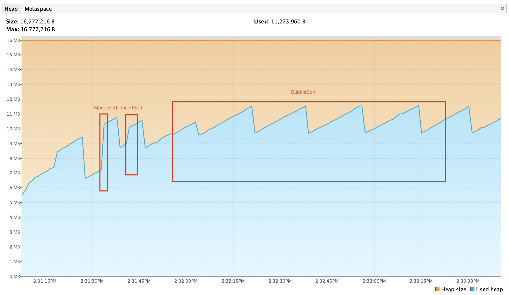
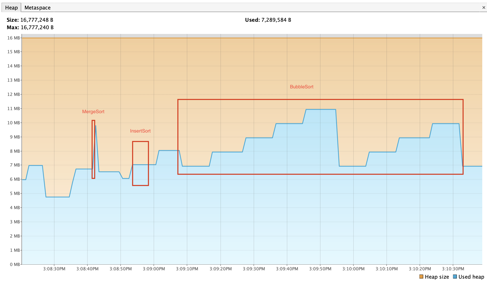
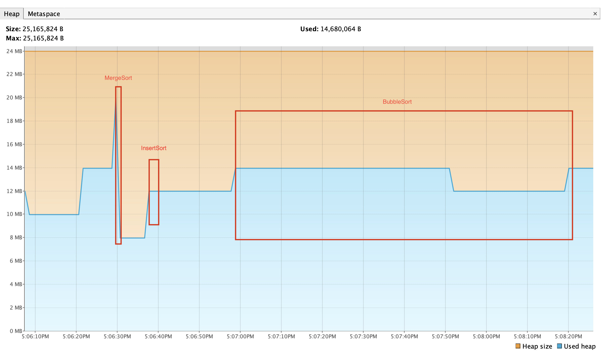

# Сводный отчёт по профилированию сортировок JVM

## 1. Исходные условия
- JVM: OpenJDK 17
- Размер массива: 250 000 элементов
- Алгоритмы: MergeSort, InsertSort, BubbleSort
- Параметры для тестов:
    - **Parallel GC**: `-Xms12m -Xmx12m -XX:+UseParallelGC -Xlog:gc:log.txt:time,level,tags`
    - **G1 GC**: `-Xms12m -Xmx12m -XX:+UseG1GC -Xlog:gc:log.txt:time,level,tags`
    - **ZGC**: `-Xms24m -Xmx24m -XX:+UseZGC -Xlog:gc:log.txt:time,level,tags`

---

## 2. Таймкоды сортировок

| Алгоритм   | Parallel GC         | G1 GC               | ZGC (24 MB heap)   |
|------------|------------------|------------------|------------------|
| MergeSort  | 14:31:33.531 → 14:31:33.588 (~56 мс) | 15:08:41.640 → 15:08:41.699 (~59 мс) | 17:06:29.570 → 17:06:29.645 (~75 мс) |
| InsertSort | 14:31:40.950 → 14:31:44.188 (~3.24 с) | 15:08:53.171 → 15:08:56.422 (~3.25 с) | 17:06:37.205 → 17:06:40.461 (~3.26 с) |
| BubbleSort | 14:31:55.790 → 14:33:21.199 (~1 мин 25 с) | 15:09:07.657 → 15:10:32.715 (~1 мин 25 с) | 17:06:58.388 → 17:08:21.709 (~1 мин 23 с) |

---

## 3. Активность GC

### Parallel GC
| Период       | GC события       | Heap usage | Паузы |
|--------------|-----------------|------------|-------|
| MergeSort    | Young, ~10 сборок | 7–10 MB    | 0.1–2.8 ms |
| InsertSort   | почти нет GC      | 4–6 MB     | <1 ms |
| BubbleSort   | Young, 1 сборка   | 9–11 MB    | 0.2–1.1 ms |

### G1 GC
| Период       | GC события                 | Heap usage | Паузы |
|--------------|---------------------------|------------|-------|
| MergeSort    | Young, Remark, Mixed       | 7–10 MB    | 0.1–2.8 ms |
| InsertSort   | Young, concurrent          | 6–10 MB    | <1 ms |
| BubbleSort   | Young, Mixed               | 9–11 MB    | 0.2–3.0 ms |

### ZGC (24 MB heap)
| Период           | Тип сборки                  | Heap usage | Паузы |
|-----------------|----------------------------|------------|-------|
| Warmup           | Warmup GC                  | 4–18 MB    | короткие, <1 ms |
| Allocation Rate  | Allocation Rate GC         | 8–12 MB    | 0.1–1.0 ms |
| Proactive        | Proactive GC               | 12–24 MB   | минимальные, предсказуемые |
| Allocation Stall | Allocation Stall           | 16–24 MB   | ~12 ms |

---

## 4. Выводы

- **Parallel GC**:
    - Короткие паузы (<5 ms), MergeSort вызывает частые Young GC.
    - InsertSort и BubbleSort почти не нагружают GC, BubbleSort медленный из-за O(n²).

- **G1 GC**:
    - Конкуррентная сборка, стабильные паузы. MergeSort и BubbleSort вызывают эвакуации памяти.
    - InsertSort почти не нагружает GC.

- **ZGC (24 MB heap)**:
    - Почти полностью конкуррентный, паузы <1 ms.
    - Большой heap уменьшает частоту Allocation Stall.
    - MergeSort требует сборок, но паузы остаются минимальными.
    - BubbleSort и InsertSort почти не влияют на GC.

- **Общие наблюдения**:
    - Увеличение heap для ZGC улучшает стабильность и уменьшает вероятность Allocation Stall.
    - Медленная работа BubbleSort обусловлена вычислительной сложностью, а не GC.
    - Parallel и G1 GC предсказуемы при малом heap, но паузы чуть длиннее.

---

## 5. Скриншоты профилирования

Parallel GC    |
G1 GC          |
ZGC 24 MB      |